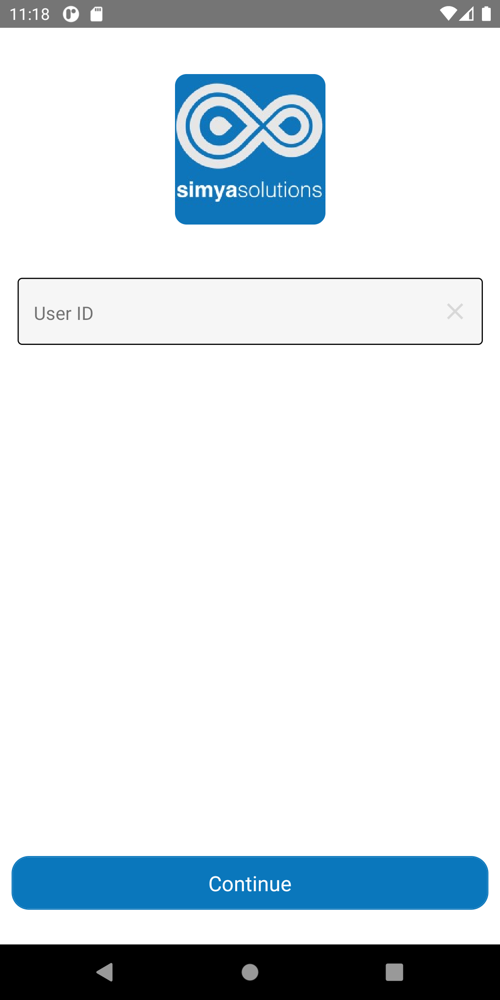
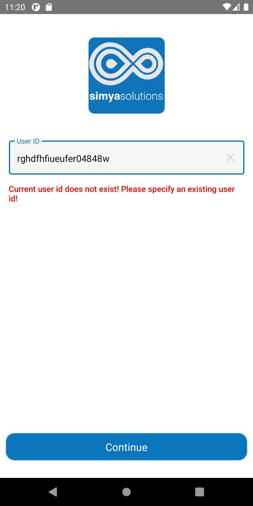

# CaseStudy

# **Guideline**

### **Steps For Android:**
1. npm install
2. Create local.properties file under android folder 
3. Add sdk path in local.properties file (for run android emulator)
4. Open emulator and install app on that emulator
5. Open the app and **input userId** to start testing
6. Scroll and view the users table list

---------------------------------------------------------------------------------

### **Steps For IOS:**
1. npm install
2. In terminal go to ios folder and pod install
3. Open xcode (ios/CaseStudy.xcworkspace) and run
4. Open the app and **input userId** to start testing
5. Scroll and view the users table list

#### Home Screen

#### UserId Not Found Screen

#### Users List Screen Recording

<video type="video/mp4" src="./assets/videos/UsersList.mp4" width="720" height="405" preload="auto" controls></video>